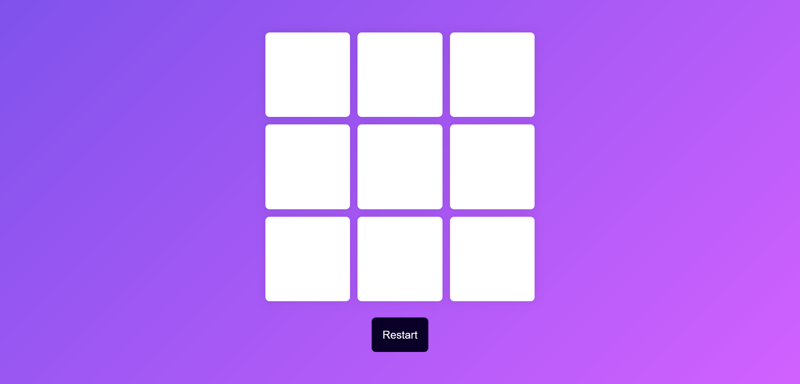

# X/O Game

This is a simple X/O (Tic-Tac-Toe) game built using HTML, CSS, and JavaScript. The game allows two players to take turns marking spaces in a 3x3 grid, with the goal of getting three marks in a row either horizontally, vertically, or diagonally.

## Table of Contents

- [Design](#design)
- [Features](#features)
- [How to Play](#how-to-play)
- [Links](#links)
- [Author](#author)

## Design

## Features

- **9-Button Grid**: The game board is represented by 9 buttons that players can click to make their move.
- **Restart Button**: Allows players to reset the game at any time.
- **Popup Notification**: Displays a message when a player wins or the game ends in a draw, with an option to start a new game.

## How to Play

1. Open `index.html` in your browser.
2. Players take turns clicking on the buttons to mark their moves (typically X or O).
3. The first player to get three marks in a row (horizontally, vertically, or diagonally) wins the game.
4. If all buttons are filled and no player has three in a row, the game ends in a draw.
5. Use the "Restart" button to reset the game or the "New Game" button in the popup to start again.

## Links

- **Repo**: [Github Repo](https://github.com/basemsameh/X-O-Game.git)
- **Demo**: [Live URL](https://basemsameh.github.io/X-O-Game/)

## Author

- **Name**: [Basem](Basem)
- **GitHub**: [Your GitHub Profile](https://github.com/basemsameh)
- **Linkedin**: [Linkedin](https://www.linkedin.com/in/basem-sameh-671b5b212/)
